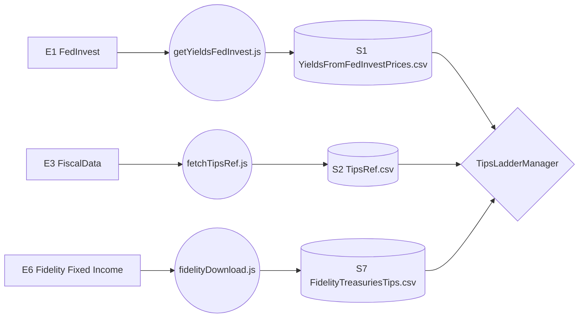

# 3.1 Data Pipeline (TIPS Logic)

## Dependencies
**Requires:** [TIPS Basics](../../knowledge/TIPS_Basics.md)

---

## 1.0 Data Context (DFD)

This diagram shows the flow of TIPS-specific metadata and price data.

---

## 2.0 Ingestion Processes

### [getYieldsFedInvest.js](../../scripts/getYieldsFedInvest.js)
FedInvest price ingestion — the cross-check source (see §4.0).
- **Frequency**: Daily (Weekdays ~1 PM ET).
- **Logic**: Scrapes the FedInvest daily price table for all TIPS. Cross-references with `TipsRef.csv` to calculate YTM (Excel YIELD convention).
- **Output**: `YieldsFromFedInvestPrices.csv`.

### [fetchTipsRef.js](../../scripts/fetchTipsRef.js)
Fetches immutable TIPS metadata from the FiscalData API.
- **Frequency**: Weekly (or on-demand for new issuances).
- **Logic**: Queries the `auctions_query` endpoint for TIPS with "Original" issuance type.
- **Output**: `TipsRef.csv` (contains Coupon, Dated Date, and Base CPI).

### [fidelityDownload.js](../../../YieldCurves/scripts/fidelityDownload.js)
Fidelity price/yield ingestion — the default source (see §4.0). Shared with YieldCurves (owns the task).
- **Frequency**: 3× weekdays (Windows Task Scheduler task `FidelityQuotes`).
- **Logic**: Playwright-driven download of Fidelity's secondary-market Treasury+TIPS offerings, uploaded to R2.
- **Output**: `FidelityTreasuriesTips.csv` (combined Treasury+TIPS; TipsLadderManager uses TIPS rows' ask price, recomputing yield from it rather than trusting the file's own quoted yield column — see §4.0).

---

## 3.0 Data Elements
*Refer to the [DATA_DICTIONARY.md](../../knowledge/DATA_DICTIONARY.md) for full definitions.*

- **[Yield](../../knowledge/DATA_DICTIONARY.md#yield)**: The yield-to-maturity (YTM) used for ladder discounting.
- **[Base CPI](../../knowledge/DATA_DICTIONARY.md#ref-cpi)**: The reference CPI on the bond's dated date, used for [Index Ratio](../../knowledge/DATA_DICTIONARY.md#index-ratio) calculations. Sourced from `TipsRef.csv` regardless of yield source — `FidelityTreasuriesTips.csv` doesn't carry it.

---

## 4.0 Yield Sources

TipsLadderManager sources price/yield from Fidelity's broker quotes by default — the underlying source is never named in the UI (not advertising where the data is scraped from). Instead the info strip (`#info-source`) shows the dates that matter: `Trade: MM/DD/YYYY · Settle: MM/DD/YYYY · Ref CPI: MM/DD/YYYY` (Trade = the data's as-of/"today" date, Settle = T+1; Ref CPI is a clickable link, `#refcpi-link`, consolidated into the same strip rather than a separate element). `src/data.js`'s `fetchFidelityTipsData()` and `fetchTipsData()` (FedInvest) both return the same `yieldsRows` shape (`{ settlementDate, cusip, maturity, coupon, baseCpi, price, yield }`) so downstream ladder math (`buildTipsMapFromYields`, `ladder-core.js`) is source-agnostic.

FedInvest is **not exposed to users at all** — no UI control selects it. It's kept as a dormant cross-check path (matches [tipsladder.com](https://tipsladder.com), which uses FedInvest): flip the `YIELD_SOURCE` constant near the top of `index.html`'s `loadData()` to `'fedinvest'` to re-enable it for local/dev cross-checking. (An earlier version of this feature exposed both sources via a dropdown in Row 1 — removed 2026-07-24: the input card was already crowded, especially in Build mode, and a rarely-used cross-check path didn't warrant a permanent slot. If it's reinstated, keep it subtle rather than a prominent dropdown.)

| | **Market (Fidelity), default** | **FedInvest, dormant** |
|---|---|---|
| Price | Fidelity's own quoted ask price | TreasuryDirect midpoint (bid+ask)/2 |
| Yield | Computed from ask price via `yieldFromPrice()` (`shared/src/bond-math.js`) | Computed from price via the same `yieldFromPrice()` |
| Settlement date | T+1 from Fidelity's download date (real broker trade settlement) | T (the FedInvest file's own reference date — required for its price↔yield pairing to stay internally consistent; see below) |
| Use case | Default — reflects what you'd actually pay/earn placing a real order | Cross-checking against tipsladder.com |

**Why yield is computed from price rather than read from Fidelity's own quoted yield column:** verified empirically (2026-07) that `yieldFromPrice()` produces a more accurate yield than Fidelity's own quoted ask-yield-to-maturity field for TIPS. Matches the convention YieldCurves already uses for TIPS (`buildProcessedTipsBonds` in `YieldCurves/src/app.js`).

**Settlement date conventions — do not conflate:** `settlementDate` (drives yield/duration/index-ratio math, source-dependent as above) is a *different concept* from the Trade Ticket's accrued-interest settlement date, which is always the forward T+1 trading day from today regardless of which yield source is active (`ttSettlementDate` in `index.html`, see 5.0 §Trade Ticket). FedInvest's own settlement date is T, not T+1, specifically because that's the reference point its own price→yield computation was performed against — using T+1 there would desynchronize FedInvest's price and yield. Conflating the two settlement dates caused a real accrued-interest bug (fixed 2026-07-24, see 5.0 §Trade Ticket) and must not recur when extending either source.
